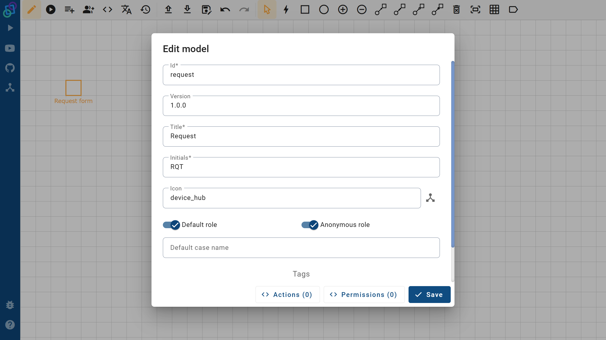
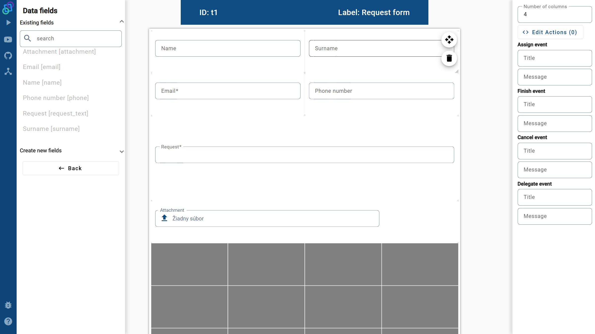

# Petriflow 101 — Part 1
### Creating First Form

This tutorial guides you through creating the **Request Form** process in **[Netgrif Application Builder](https://builder.netgrif.cloud)** using PetriFlow.  
By following these steps, you’ll reproduce the structure shown in the first 12 minutes of the PetriFlow course video.

---

## 🎯 Objective

You will build a **Request form** that allows users to:
- Enter personal details (Name, Surname, Email, Phone)
- Write a short message
- Optionally upload an attachment
- Submit anonymously via a public link

---

## Steps

1. **Open Netgrif Application Builder**
    - Go to **[builder.netgrif.cloud](https://builder.netgrif.cloud)** and sign in.

2. **Create a new process**
    - Click **Create process** and name it **Request**.
    - Fill metadata (ID `request`, Title `Request`, Initials `RQT`, Icon `device_hub`).

3. **Set up the form layout**
    - In **Form Editor**, choose **grid layout** with **4 columns**.
    - Add one **task/transition** labeled **Request form** and set **assignPolicy = auto**.

4. **Add form fields**
    - **Row 1:** `Name` (Text, 2 cols), `Surname` (Text, 2 cols)
    - **Row 2:** `Email` (Text, required, 2 cols), `Phone number` (Text, 2 cols)
    - **Row 3:** `Request` (Textarea, required, spans 4 cols × 2 rows)
    - **Row 5:** `Attachment` (File, with **preview**, spans 4 cols)

5. **Configure access**
    - Enable **defaultRole** and **anonymousRole** to allow public/anonymous submissions.
    - Keep **transitionRole = false**.

6. **Validate & preview**
    - Add a simple email validation (regex).
    - Save and **Preview** the form to ensure the layout matches the design.

---

<!-- tabs:start -->

#### **🎥 Video**

Watch the “Form Creation” segment (00:00–12:40):

<div class="container">
    <iframe class="responsive-iframe" src="https://www.youtube.com/embed/sAVgSaBOkUE?si=b8hDEyRpqj79JnQy" title="YouTube video player"
    allow="accelerometer; autoplay; clipboard-write; encrypted-media; gyroscope; picture-in-picture"
    allowfullscreen></iframe>
</div>

#### **📄 Source Code (XML)**

[Open in Builder](https://builder.netgrif.cloud/modeler?modelUrl=https://academy.netgrif.com/tutorials/petriflow101/part1/request-form.xml)

> 💡 **Tip:** `defaultRole` and `anonymousRole` let any user open and submit the form; `assignPolicy="auto"` ensures it appears immediately when the process starts.

<details open>
<summary>📄 Full source-code (XML)</summary>

```xml
<?xml version="1.0" encoding="UTF-8"?>
<document xmlns:xsi="http://www.w3.org/2001/XMLSchema-instance"
          xsi:noNamespaceSchemaLocation="https://petriflow.com/petriflow.schema.xsd">
    <id>request</id>
    <version>1.0.0</version>
    <initials>RQT</initials>
    <title>Request</title>
    <icon>device_hub</icon>
    <defaultRole>true</defaultRole>
    <anonymousRole>true</anonymousRole>
    <transitionRole>false</transitionRole>

    <data type="file">
        <id>attachment</id>
        <title>Attachment</title>
    </data>

    <data type="text">
        <id>email</id>
        <title>Email</title>
        <validations>
          <validation>
            <expression>regex ^[\w-\.]+@([\w-]+\.)+[\w-]{2,4}$</expression>
            <message>Please type a valid email</message>
          </validation>
        </validations>
    </data>

    <data type="text"><id>name</id><title>Name</title></data>
    <data type="text"><id>surname</id><title>Surname</title></data>
    <data type="text"><id>phone</id><title>Phone number</title></data>

    <data type="text">
        <id>request_text</id>
        <title>Request</title>
    </data>

    <transition>
        <id>t1</id>
        <x>336</x>
        <y>112</y>
        <label>Request form</label>
        <assignPolicy>auto</assignPolicy>

        <dataGroup>
            <id>t1_0</id>
            <cols>4</cols>
            <layout>grid</layout>

            <dataRef>
                <id>name</id>
                <logic><behavior>editable</behavior></logic>
                <layout>
                    <x>0</x><y>0</y><rows>1</rows><cols>2</cols>
                    <template>material</template><appearance>outline</appearance>
                </layout>
            </dataRef>

            <dataRef>
                <id>surname</id>
                <logic><behavior>editable</behavior></logic>
                <layout>
                    <x>2</x><y>0</y><rows>1</rows><cols>2</cols>
                    <template>material</template><appearance>outline</appearance>
                </layout>
            </dataRef>

            <dataRef>
                <id>email</id>
                <logic><behavior>editable</behavior><behavior>required</behavior></logic>
                <layout>
                    <x>0</x><y>1</y><rows>1</rows><cols>2</cols>
                    <template>material</template><appearance>outline</appearance>
                </layout>
            </dataRef>

            <dataRef>
                <id>phone</id>
                <logic><behavior>editable</behavior></logic>
                <layout>
                    <x>2</x><y>1</y><rows>1</rows><cols>2</cols>
                    <template>material</template><appearance>outline</appearance>
                </layout>
            </dataRef>

            <dataRef>
                <id>request_text</id>
                <logic><behavior>editable</behavior><behavior>required</behavior></logic>
                <layout>
                    <x>0</x><y>2</y><rows>2</rows><cols>4</cols>
                    <template>material</template><appearance>outline</appearance>
                </layout>
                <component><name>textarea</name></component>
            </dataRef>

            <dataRef>
                <id>attachment</id>
                <logic><behavior>editable</behavior></logic>
                <layout>
                    <x>0</x><y>4</y><rows>1</rows><cols>4</cols>
                    <template>material</template><appearance>outline</appearance>
                </layout>
                <component><name>preview</name></component>
            </dataRef>
        </dataGroup>
    </transition>
</document>
```
[📄 request-form.xml](./tutorials/petriflow101/part1/request-form.xml)

</details>

#### **🧱 Preview**

1. **Workflow and metadata overview**  
   The Builder’s **Edit Model** and **Edit View** screens showing the process workflow and metadata configuration.  
   

2. **Form layout in Builder**  
   The **Form Editor** view displaying the layout
   


#### **🧾 Description**

Each field corresponds to an XML `<dataRef>` above.

| Position | Field | Type | Required | Size            | Component |
|-----------|--------|------|-----------|-----------------|----------|
| Row 1 Col 0–1 | Name | Text | No | 2 cols |          |
| Row 1 Col 2–3 | Surname | Text | No | 2 cols |          |
| Row 2 Col 0–1 | Email | Text | Yes | 2 cols |          |
| Row 2 Col 2–3 | Phone | Text | No | 2 cols |          |
| Row 3 Full | Request Text | Text | Yes | 4 cols × 2 rows | Textarea |
| Row 5 Full | Attachment | File | No | 4 cols          | Preview  |

- A single task labeled **Request form**
- A **4-column grid** with Name/Surname on the first row, Email/Phone on the second row
- A **textarea** named **Request** spanning the full width
- A **file** input with **preview** on the last row
- **Email** and **Request** are **required**

<!-- tabs:end -->

---

## ✅ Summary

You’ve created the complete **Request form** process:
- All fields mapped to XML with validation and appearance
- Layout fully defined in a grid
- Public form behavior enabled (`anonymousRole`, `auto` assignment)
- Ready for deployment in eTask (covered in the next tutorial)

---