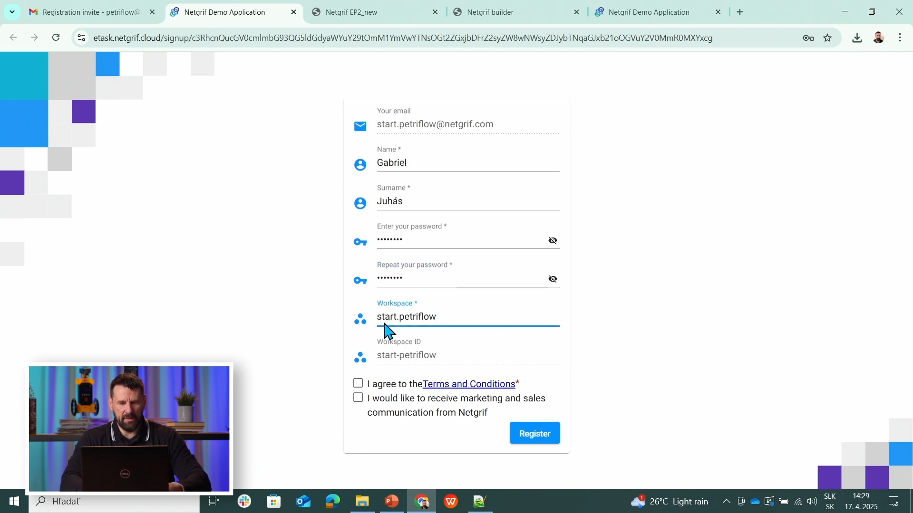
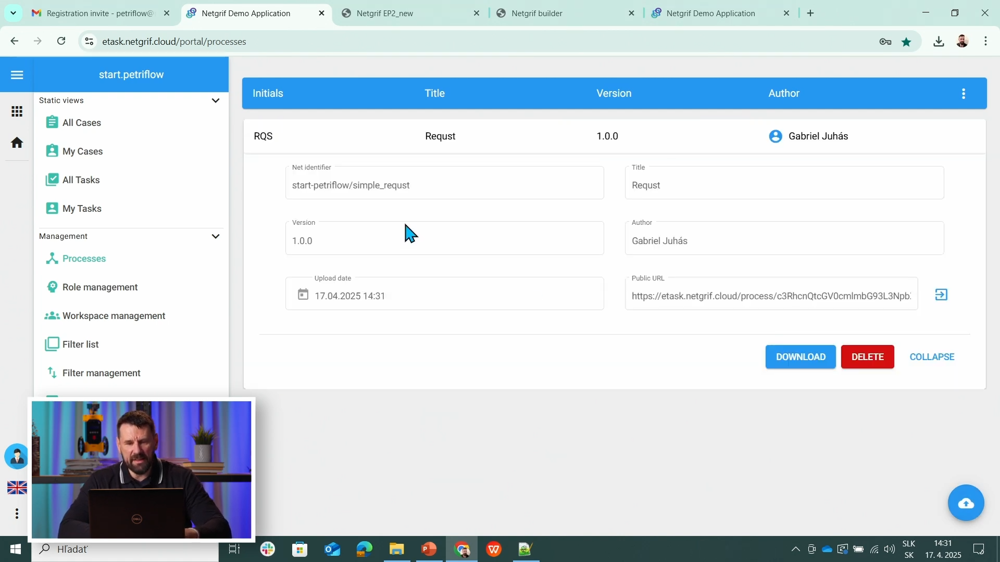
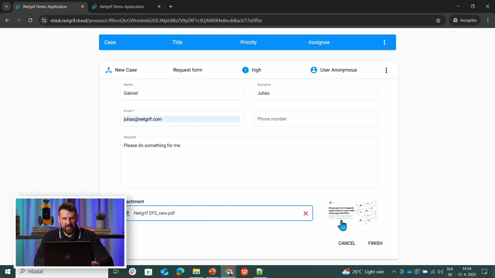
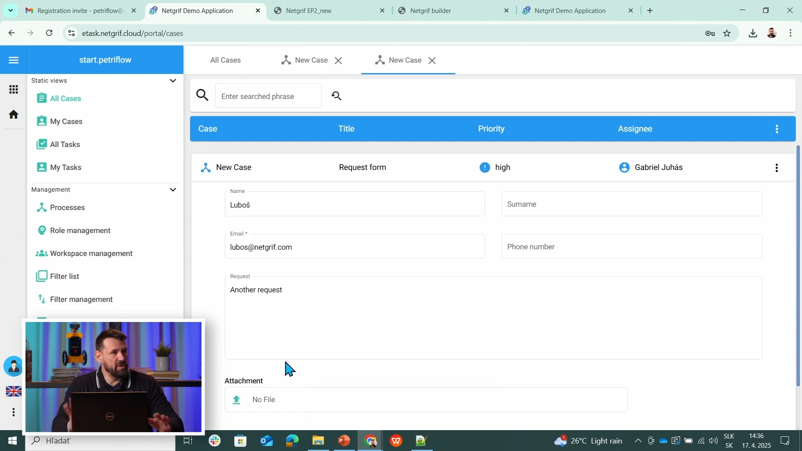

# Petriflow 101 — Part 2
### First Deployment (Upload) in eTask

This tutorial continues from **Part 1 — Creating the Request Form** and shows how to **deploy and test** your process in **eTask** using both **anonymous** and **logged-in** access.

---

## 🎯 Objective

You will:
- Export the `Request` process model from **Netgrif Application Builder**
- Register and log into **[eTask](https://etask.netgrif.cloud/)**
- Upload and deploy the process
- Test the **public (anonymous)** submission link
- Verify the submitted request as a logged-in user

---

## Steps

1. **Download the Request model source code**
   - From **Part 1**, open your process **Request** in the Builder.
   - Click **Export → PetriFlow XML** and save the file as `request.xml`.
   - This XML defines all data fields, layout, and behaviors.

2. **Open eTask**
   - Navigate to **[etask.netgrif.cloud](https://etask.netgrif.cloud/)**.
   - Click **Register** and create a new account.
   - After registration, **log in** with your new credentials.

3. **Upload the Request process**
   - Go to the **Process Models** section in the left menu.
   - Click **Upload**, choose your `request.xml` file, and confirm.
   - The process appears in your workspace with its title, ID, and version.

4. **Verify process details**
   - Check that the name and version match what you created in Builder.
   - The process icon and initials (RQT) should also be visible.
   - You can open the **process preview** to confirm it includes all fields.

5. **Open the public (anonymous) link**
   - In the process view, click on **Public link** or **Open anonymously**.
   - The Request form opens as if you were an unregistered visitor.
   - Fill in Name, Surname, Email, Phone, Request text, and optionally upload a file.
   - Click **Submit**.

6. **View the case as a logged-in user**
   - Return to your logged-in **eTask** workspace.
   - Go to **Cases** or **Tasks** to see the new submitted Request.
   - Open the case to inspect data and verify that the anonymous submission was received.

---

<!-- tabs:start -->

#### **🎥 Video**

Watch the “First Deployment (Upload) in eTask” segment (12:40–21:33):

<div class="container">
    <iframe class="responsive-iframe" src="https://www.youtube.com/embed/sAVgSaBOkUE?si=b8hDEyRpqj79JnQy&amp;start=760&amp;end=1293" title="YouTube video player"
    allow="accelerometer; autoplay; clipboard-write; encrypted-media; gyroscope; picture-in-picture"
    allowfullscreen></iframe>
</div>

#### **📄 Source Code (XML)**

[Open in Builder](https://builder.netgrif.cloud/modeler?modelUrl=https://academy.netgrif.com/tutorials/petriflow101/part1/request-form.xml)

> 💡 **Tip:** The same XML model from Part 1 is used here. eTask automatically interprets PetriFlow definitions on upload and creates an executable process.

<details open>
<summary>📄 Full source-code (XML)</summary>

```xml
<?xml version="1.0" encoding="UTF-8"?>
<document xmlns:xsi="http://www.w3.org/2001/XMLSchema-instance"
          xsi:noNamespaceSchemaLocation="https://petriflow.com/petriflow.schema.xsd">
   <id>request</id>
   <version>1.0.0</version>
   <initials>RQT</initials>
   <title>Request</title>
   <icon>device_hub</icon>
   <defaultRole>true</defaultRole>
   <anonymousRole>true</anonymousRole>
   <transitionRole>false</transitionRole>

   <data type="file">
      <id>attachment</id>
      <title>Attachment</title>
   </data>

   <data type="text">
      <id>email</id>
      <title>Email</title>
   </data>

   <data type="text"><id>name</id><title>Name</title></data>
   <data type="text"><id>surname</id><title>Surname</title></data>
   <data type="text"><id>phone</id><title>Phone number</title></data>

   <data type="text">
      <id>request_text</id>
      <title>Request</title>
   </data>

   <transition>
      <id>t1</id>
      <x>336</x>
      <y>112</y>
      <label>Request form</label>
      <assignPolicy>auto</assignPolicy>

      <dataGroup>
         <id>t1_0</id>
         <cols>4</cols>
         <layout>grid</layout>

         <dataRef>
            <id>name</id>
            <logic><behavior>editable</behavior></logic>
            <layout>
               <x>0</x><y>0</y><rows>1</rows><cols>2</cols>
               <template>material</template><appearance>outline</appearance>
            </layout>
         </dataRef>

         <dataRef>
            <id>surname</id>
            <logic><behavior>editable</behavior></logic>
            <layout>
               <x>2</x><y>0</y><rows>1</rows><cols>2</cols>
               <template>material</template><appearance>outline</appearance>
            </layout>
         </dataRef>

         <dataRef>
            <id>email</id>
            <logic><behavior>editable</behavior><behavior>required</behavior></logic>
            <layout>
               <x>0</x><y>1</y><rows>1</rows><cols>2</cols>
               <template>material</template><appearance>outline</appearance>
            </layout>
         </dataRef>

         <dataRef>
            <id>phone</id>
            <logic><behavior>editable</behavior></logic>
            <layout>
               <x>2</x><y>1</y><rows>1</rows><cols>2</cols>
               <template>material</template><appearance>outline</appearance>
            </layout>
         </dataRef>

         <dataRef>
            <id>request_text</id>
            <logic><behavior>editable</behavior><behavior>required</behavior></logic>
            <layout>
               <x>0</x><y>2</y><rows>2</rows><cols>4</cols>
               <template>material</template><appearance>outline</appearance>
            </layout>
            <component><name>textarea</name></component>
         </dataRef>

         <dataRef>
            <id>attachment</id>
            <logic><behavior>editable</behavior></logic>
            <layout>
               <x>0</x><y>4</y><rows>1</rows><cols>4</cols>
               <template>material</template><appearance>outline</appearance>
            </layout>
            <component><name>preview</name></component>
         </dataRef>
      </dataGroup>
   </transition>
</document>
```
</details>

#### **🧱 Preview**

1. **Registration and login screen:**  
   The user registers and signs in to eTask.  
   

2. **Uploaded process model:**  
   The Request process appears in the Process Models view after upload.  
   

3. **Anonymous link (public form):**  
   The form is opened by clicking “Public link”, allowing submission without login.  
   

4. **Logged-in verification:**  
   In the logged-in view, the same request is visible under “Cases”.  
   

#### **🧾 Description**

This part demonstrates how to **publish** your Builder-created process into the live eTask environment.  
You’ll see how eTask allows both **public submissions** and **authenticated management** of cases.

| Step | Action | Purpose |
|------|---------|----------|
| 1 | Export XML | Retrieve PetriFlow source from Builder |
| 2 | Register & Login | Access eTask workspace |
| 3 | Upload Process | Deploy the model into eTask |
| 4 | Open Public Link | Test anonymous form submission |
| 5 | Verify Case | Check data as logged-in user |

<!-- tabs:end -->

---

## ✅ Summary

You’ve now completed your **first deployment** to eTask — exporting, uploading, and testing your Request form both anonymously and as a registered user.  
This confirms that your PetriFlow model from the Builder can be executed in a real environment.

---