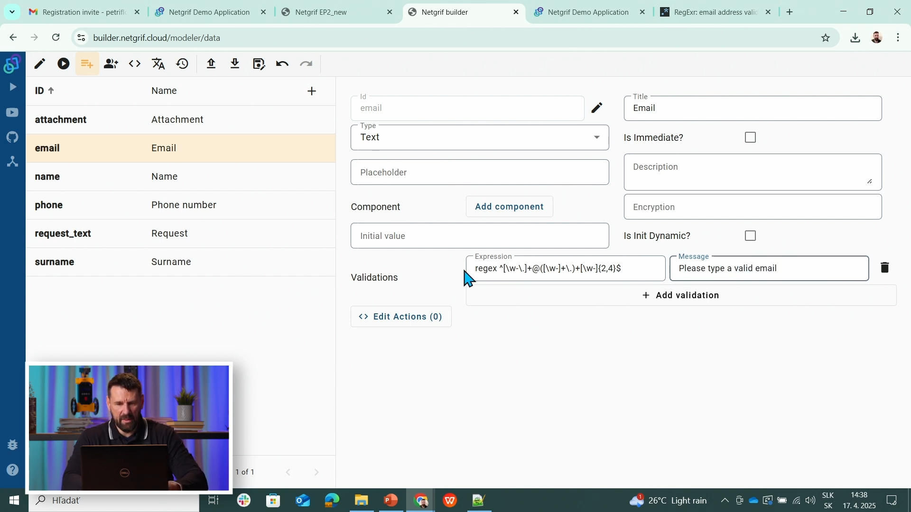
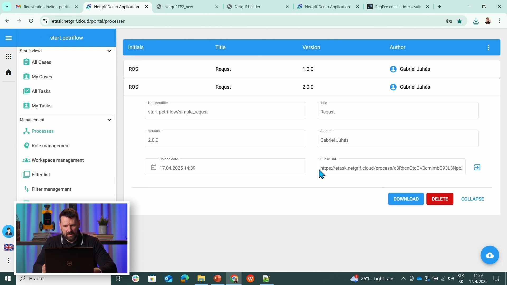
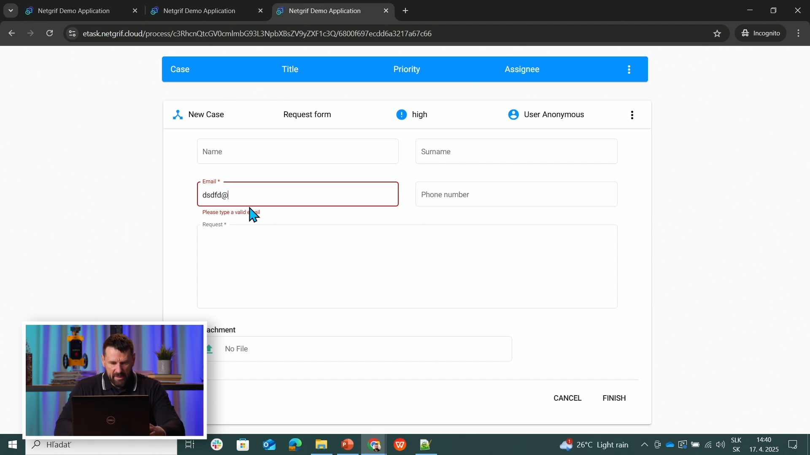

# Petriflow 101 — Part 3
### Rapid Change: Adding Email Validation & Redeploying to eTask

This tutorial demonstrates how easily you can **modify and redeploy** your PetriFlow application.  
With just a small update — adding an **email validation rule** — you’ll learn how **rapid iteration** works between **Netgrif Application Builder** and **eTask**.

---

## 🎯 Objective

You will:
- Apply a quick change (email validation) to your existing *Request* form
- Re-export the updated PetriFlow XML
- Upload the new version to **eTask**
- See how rapid updates automatically reflect in the running environment

---

## Steps

1. **Open your Request process**
   - In **[Netgrif Application Builder](https://builder.netgrif.cloud)**, open the `Request` process from the previous tutorial.

2. **Add a quick improvement – email validation**
   - Open the `email` field and add a **regex** rule that checks for a valid address format.
   - Provide an error message such as: *“Please enter a valid email address.”*

3. **Export the updated model**
   - Export the modified process as a new XML (e.g. `request_v2.xml`).
   - You can treat this as a **rapid iteration** — no need to recreate the form.

4. **Redeploy to eTask**
   - Log in to **[eTask](https://etask.netgrif.cloud)**.
   - Go to **Processes → Upload** and select your updated XML.
   - Deploy it — the system now contains **two versions** of the same process.

5. **Validate the changes**
   - Open the public link of your Request form.
   - Try entering invalid and valid email formats.
   - Observe the validation feedback instantly in the running application.

6. **Check version behavior**
   - Previously created requests remain under the **old version**.
   - New submissions automatically use the **latest version** with validation enabled.

---

<!-- tabs:start -->

#### **🎥 Video**

Watch “Rapid Change & Second Deployment” (21:33–24:16):

<div class="container">
  <iframe class="responsive-iframe" src="https://www.youtube.com/embed/sAVgSaBOkUE?start=1293&end=1456" 
  title="YouTube video player"
  allow="accelerometer; autoplay; clipboard-write; encrypted-media; gyroscope; picture-in-picture"
  allowfullscreen></iframe>
</div>

#### **📄 Source Code (XML)**

[Open in Builder](https://builder.netgrif.cloud/modeler?modelUrl=https://academy.netgrif.com/tutorials/petriflow101/part3/request-form.xml)

> 💡 **Tip:** Even a small change (like adding regex validation) requires redeployment to update the active version in eTask.

<details>
<summary>📄 Example XML Snippet</summary>

```xml
<?xml version="1.0" encoding="UTF-8"?>
<document xmlns:xsi="http://www.w3.org/2001/XMLSchema-instance"
          xsi:noNamespaceSchemaLocation="https://petriflow.com/petriflow.schema.xsd">
   <id>request</id>
   <version>1.0.0</version>
   <initials>RQT</initials>
   <title>Request</title>
   <icon>device_hub</icon>
   <defaultRole>true</defaultRole>
   <anonymousRole>true</anonymousRole>
   <transitionRole>false</transitionRole>

   <data type="file">
      <id>attachment</id>
      <title>Attachment</title>
   </data>

   <data type="text">
      <id>email</id>
      <title>Email</title>
      <validations>
         <validation>
            <expression>regex ^[\\w-\\.]+@([\\w-]+\\.)+[\\w-]{2,4}$</expression>
            <message>Please type a valid email</message>
         </validation>
      </validations>
   </data>

   <data type="text"><id>name</id><title>Name</title></data>
   <data type="text"><id>surname</id><title>Surname</title></data>
   <data type="text"><id>phone</id><title>Phone number</title></data>

   <data type="text">
      <id>request_text</id>
      <title>Request</title>
   </data>

   <transition>
      <id>t1</id>
      <x>336</x>
      <y>112</y>
      <label>Request form</label>
      <assignPolicy>auto</assignPolicy>

      <dataGroup>
         <id>t1_0</id>
         <cols>4</cols>
         <layout>grid</layout>

         <dataRef>
            <id>name</id>
            <logic><behavior>editable</behavior></logic>
            <layout>
               <x>0</x><y>0</y><rows>1</rows><cols>2</cols>
               <template>material</template><appearance>outline</appearance>
            </layout>
         </dataRef>

         <dataRef>
            <id>surname</id>
            <logic><behavior>editable</behavior></logic>
            <layout>
               <x>2</x><y>0</y><rows>1</rows><cols>2</cols>
               <template>material</template><appearance>outline</appearance>
            </layout>
         </dataRef>

         <dataRef>
            <id>email</id>
            <logic><behavior>editable</behavior><behavior>required</behavior></logic>
            <layout>
               <x>0</x><y>1</y><rows>1</rows><cols>2</cols>
               <template>material</template><appearance>outline</appearance>
            </layout>
         </dataRef>

         <dataRef>
            <id>phone</id>
            <logic><behavior>editable</behavior></logic>
            <layout>
               <x>2</x><y>1</y><rows>1</rows><cols>2</cols>
               <template>material</template><appearance>outline</appearance>
            </layout>
         </dataRef>

         <dataRef>
            <id>request_text</id>
            <logic><behavior>editable</behavior><behavior>required</behavior></logic>
            <layout>
               <x>0</x><y>2</y><rows>2</rows><cols>4</cols>
               <template>material</template><appearance>outline</appearance>
            </layout>
            <component><name>textarea</name></component>
         </dataRef>

         <dataRef>
            <id>attachment</id>
            <logic><behavior>editable</behavior></logic>
            <layout>
               <x>0</x><y>4</y><rows>1</rows><cols>4</cols>
               <template>material</template><appearance>outline</appearance>
            </layout>
            <component><name>preview</name></component>
         </dataRef>
      </dataGroup>
   </transition>
</document>
```
</details>

#### **🧱 Preview**

1. **Email field validation in Builder**  
   The Builder interface showing the configured **regex validation** for the Email field.  
   

2. **Process version overview in eTask**  
   The eTask **Process Models** view displaying both the original and updated versions of the Request process.  
   

3. **Validation in action**  
   The running application demonstrating how the regex validation works when entering an invalid email address.  
   

#### **🧾 Description**

This example demonstrates how **rapid changes** can be applied and redeployed with minimal effort using Netgrif tools.

| Action | Platform | Result |
|--------|-----------|--------|
| Add regex validation | Builder | XML regenerated |
| Export XML | Builder | Creates `request_v2.xml` |
| Upload | eTask | New version registered |
| Start new instance | eTask public URL | Uses updated form |

- Old instances stay on **previous XML**
- New instances automatically use **latest deployed version**
- Validation rules are enforced dynamically

<!-- tabs:end -->

---

## ✅ Summary

You’ve just made your **first rapid change** — adding validation to your Request form.  
This shows how easily you can iterate and redeploy your PetriFlow applications using **Netgrif Builder** and **eTask**:

- Small updates take just a few minutes
- Redeployment instantly activates a new version
- Users experience the improvement immediately

---